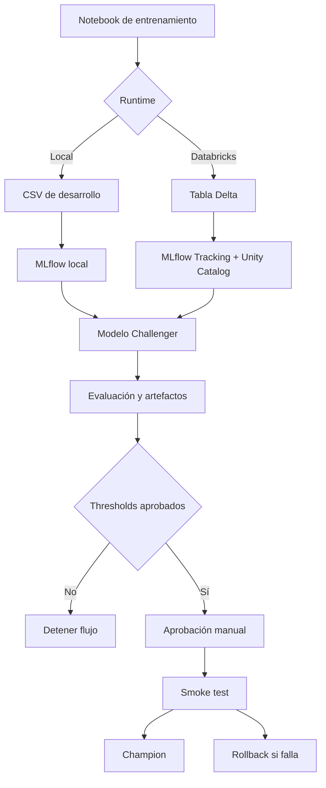

# Iris MLflow

Proyecto demostrativo y reproducible de Machine Learning para entrenar,
evaluar, registrar y promover clasificadores Iris mediante MLflow.

Aunque el dominio Iris es pequeño y educativo, el proyecto implementa un flujo
completo y reutilizable para modelos de clasificación: validación de datos,
entrenamiento con Random Forest y XGBoost, registro de versiones, evaluación
automática, aprobación controlada, despliegue, smoke test y rollback.

El mismo proyecto puede ejecutarse en dos entornos:

- **Local**, sin Spark ni Databricks, para desarrollo, pruebas y demostraciones.
- **Databricks**, con Delta, Unity Catalog, Deployment Jobs y Model Serving,
  como flujo productivo.

La ejecución local no es una copia simplificada aislada: comparte la mayor
parte de la lógica de configuración, entrenamiento, evaluación, aliases,
artefactos y gates. La diferencia principal es la infraestructura utilizada.

## Objetivos del proyecto

El proyecto busca demostrar buenas prácticas aplicables a un sistema real de
Machine Learning:

- Separar notebooks de entrenamiento de la lógica Python reutilizable.
- Mantener el origen productivo en una tabla Delta versionada.
- Registrar parámetros, métricas, artefactos, tags y descripciones en MLflow.
- Utilizar `Challenger` para candidatos y `Champion` para la versión activa.
- Comparar candidatos sobre datos reproducibles antes de promoverlos.
- Impedir que una degradación llegue al endpoint productivo.
- Ejecutar un smoke test antes de cambiar `Champion`.
- Conservar la versión anterior y permitir rollback seguro.
- Separar los recursos de desarrollo y producción.
- Validar código, dependencias, notebooks e infraestructura en CI.

## Flujo de Machine Learning

```text
datos -> entrenamiento -> registro Challenger -> evaluación y artefactos
      -> gate automático -> aprobación manual -> Model Serving
      -> smoke test -> promoción Champion
      -> rollback si el despliegue falla
```

En Databricks, el origen productivo es la tabla Delta
`workspace.default.iris_features`. Las evaluaciones registran la versión del
snapshot utilizado para que una comparación futura no dependa de leer siempre
los datos más recientes.



## Ejecución local y Databricks

Los notebooks detectan el runtime automáticamente. La precedencia es:

```text
IRIS_RUNTIME -> dbutils -> DATABRICKS_RUNTIME_VERSION -> local
```

La variable `IRIS_RUNTIME` permite hacer explícita la selección cuando se
necesita reproducir un escenario.

| Característica | Local | Databricks |
|---|---|---|
| Datos | `data/local/iris_features.csv` | `workspace.default.iris_features` |
| Motor | Pandas, scikit-learn y XGBoost | Spark y Delta |
| Tracking | MLflow local | MLflow Databricks |
| Registry | SQLite (`.local/mlflow/mlflow.db`) | Unity Catalog |
| Serving | Simulado y verificable | Model Serving real |
| Aprobación | Automática configurable | Manual mediante Job |
| Endpoint | No se crea | `iris-classifier-dev` o `iris-classifier` |
| Uso esperado | Desarrollo y pruebas | Operación productiva |

### Ejecución local

El modo local utiliza únicamente el dataset de desarrollo y una base MLflow
canónica en la raíz del proyecto. No necesita Spark, Databricks Connect ni una
cuenta cloud.

```powershell
$env:IRIS_RUNTIME = "local"
uv run --group notebooks jupyter notebook notebooks/training/random_forest.ipynb
```

Para XGBoost:

```powershell
$env:IRIS_RUNTIME = "local"
uv run --group notebooks jupyter notebook notebooks/training/xgboost.ipynb
```

Para visualizar los runs locales desde la raíz del proyecto:

```powershell
cd C:\Users\crist\Documents\MisDev\iris_mlflow
uv run mlflow ui `
  --backend-store-uri sqlite:///.local/mlflow/mlflow.db `
  --host 127.0.0.1 `
  --port 5001
```

Abre [http://127.0.0.1:5001](http://127.0.0.1:5001). El flujo local de
evaluación y promoción es:

1. Ejecutar Random Forest o XGBoost.
2. Revisar el run y la versión `Challenger` en MLflow.
3. Ejecutar `deployment/evaluate_model.ipynb`.
4. Ejecutar `deployment/approval.ipynb`.
5. Ejecutar `deployment/deploy_model.ipynb`.
6. Revisar `.local/deployment/local_deployment_manifest.json`.

La simulación local ejecuta un smoke test, promueve el alias local y genera un
manifiesto auditable. No crea un endpoint HTTP ni modifica Databricks.

### Ejecución en Databricks

El flujo productivo conserva Delta, Unity Catalog, MLflow, Deployment Jobs y
Model Serving:

```powershell
$env:IRIS_RUNTIME = "databricks"
$env:DATABRICKS_DEPLOY_ENABLED = "true"
databricks bundle validate -t dev
databricks bundle deploy -t dev
databricks bundle run -t dev connect_deployment_job
```

Estos comandos requieren una organización Databricks activa, autenticación
OIDC, el perfil configurado y permisos suficientes. Producción se ejecuta
únicamente desde `main`, mediante ejecución manual, con aprobación del
environment de GitHub y habilitación explícita del despliegue.

## Ciclo de vida del modelo

1. **Entrenamiento:** Random Forest o XGBoost aprende desde el dataset del
   runtime seleccionado.
2. **Registro:** MLflow conserva el run, los parámetros, las métricas y los
   artefactos.
3. **Challenger:** la nueva versión recibe el alias `Challenger`.
4. **Evaluación:** se carga la versión exacta y se generan artefactos sobre un
   snapshot reproducible.
5. **Comparación:** se compara contra `Champion` con la misma base de datos o
   se reevalúa el Champion sobre el snapshot del candidato.
6. **Gate:** se validan thresholds y regresión máxima permitida.
7. **Aprobación:** una persona autoriza la promoción cuando el gate pasa.
8. **Despliegue:** se crea o actualiza el endpoint con la versión exacta.
9. **Smoke test:** se verifica que el endpoint responda correctamente.
10. **Champion:** sólo después del smoke test exitoso se actualiza el alias.

Si falla la evaluación, la aprobación, el despliegue o el smoke test, el alias
`Champion` permanece sin cambios. El rollback restaura el endpoint anterior o
elimina el endpoint recién creado cuando corresponde.

## Métricas y artefactos

Cada evaluación produce y registra, según el runtime:

- Accuracy, precision, recall y F1 macro/weighted.
- Matriz de confusión absoluta y normalizada.
- Classification report y métricas por clase.
- Curva ROC multiclass OvR, macro y micro-average.
- Curvas Precision-Recall.
- Lift por clase y agregado.
- Cumulative gain chart.
- Distribución de probabilidades.
- Feature importance.
- Tabla de predicciones.
- Firma de entrada.
- Mapping de clases.

La guía de interpretación se encuentra en
[docs/model_evaluation.md](docs/model_evaluation.md).

## Buenas prácticas adoptadas

### Reproducibilidad

- Dependencias fijadas en [`uv.lock`](uv.lock).
- Configuración versionada en [`config/training.toml`](config/training.toml).
- Semillas controladas en los entrenamientos.
- Versionado de snapshots Delta en Databricks.
- Comparaciones sobre datasets equivalentes.
- Firma de entrada e `input_example` registrados.
- Parámetros, métricas, tags, descripciones y artefactos asociados a cada run.

### Calidad de código

- Librería Python compartida para la lógica de negocio.
- Notebooks enfocados en orquestación y presentación del flujo.
- Pytest con cobertura mínima del 85%.
- Ruff para lint y formato.
- MyPy para verificación de tipos.
- Build reproducible del paquete.
- Pruebas de contrato para datos, configuración y artefactos.

### Gobierno de modelos

- Las versiones históricas se conservan en MLflow.
- `Challenger` identifica candidatos pendientes de promoción.
- `Champion` identifica la versión activa.
- Tags y descripciones documentan algoritmo, framework y contexto.
- Gates automáticos bloquean versiones bajo los thresholds.
- La promoción productiva requiere aprobación.
- Activity Log, runs de evaluación y manifiestos dejan evidencia operativa.

### Seguridad

- OIDC para autenticación de GitHub Actions.
- Secretos fuera del repositorio.
- Permisos mínimos en Unity Catalog.
- Escaneo de secretos e historial.
- Dependabot para acciones y dependencias.
- `CODEOWNERS`, `SECURITY.md` y `CONTRIBUTING.md`.
- Protección de `main` y `dev` contra eliminación y force push.
- Ambiente productivo restringido a `main` y con aprobación.

### Operación segura

- Creación o actualización controlada del endpoint.
- Rollback del endpoint ante errores.
- `Champion` inmutable ante fallos.
- Despliegue Databricks desactivable con
  `DATABRICKS_DEPLOY_ENABLED`.
- Modelos, jobs y endpoints separados para desarrollo y producción.
- Preflight de identidad, tabla, modelo, permisos y colisiones antes del
  despliegue.

## Componentes

### Entrenamiento e inferencia

Estos notebooks permiten entrenar los candidatos y probar inferencias de forma
interactiva.

| Componente | Funcionalidad |
|---|---|
| [`notebooks/training/random_forest.ipynb`](notebooks/training/random_forest.ipynb) | Entrena Random Forest, registra métricas y artefactos, publica una versión y asigna `Challenger`. |
| [`notebooks/training/xgboost.ipynb`](notebooks/training/xgboost.ipynb) | Ejecuta el mismo contrato de entrenamiento y registro utilizando XGBoost. |
| [`notebooks/serving/test_endpoint.ipynb`](notebooks/serving/test_endpoint.ipynb) | Prueba manualmente el endpoint desplegado con datos Iris y revisa su respuesta. |
| [`notebooks/serving/endpoint_client.ipynb`](notebooks/serving/endpoint_client.ipynb) | Cliente interactivo reutilizable para invocar un endpoint de Databricks Model Serving. |

### Evaluación, aprobación y promoción

Estos notebooks implementan el flujo controlado posterior al registro.

| Componente | Funcionalidad |
|---|---|
| [`deployment/evaluate_model.ipynb`](deployment/evaluate_model.ipynb) | Carga una versión exacta, genera artefactos, aplica thresholds y la compara contra `Champion`. |
| [`deployment/approval.ipynb`](deployment/approval.ipynb) | Comprueba la aprobación `Approval_Check=Approved` y detiene el flujo si falta. |
| [`deployment/deploy_model.ipynb`](deployment/deploy_model.ipynb) | Actualiza Model Serving, espera `READY`, ejecuta el smoke test y promueve `Champion`. |
| [`deployment/create_deployment_job.ipynb`](deployment/create_deployment_job.ipynb) | Conecta el Job administrado por el bundle con el modelo registrado mediante `deployment_job_id`. |

### Librería Python compartida

La librería concentra las reglas para que local y Databricks mantengan el mismo
contrato funcional.

| Componente | Funcionalidad |
|---|---|
| [`src/iris_mlflow_utils/config.py`](src/iris_mlflow_utils/config.py) | Lee, valida y resuelve la configuración local o Databricks. |
| [`src/iris_mlflow_utils/constants.py`](src/iris_mlflow_utils/constants.py) | Centraliza nombres de columnas, clases y valores compartidos. |
| [`src/iris_mlflow_utils/runtime.py`](src/iris_mlflow_utils/runtime.py) | Detecta el runtime y obtiene parámetros sin depender directamente de `dbutils` en local. |
| [`src/iris_mlflow_utils/data.py`](src/iris_mlflow_utils/data.py) | Carga y valida el dataset correspondiente a cada runtime. |
| [`src/iris_mlflow_utils/feature_table.py`](src/iris_mlflow_utils/feature_table.py) | Contiene utilidades explícitas de preparación de la tabla de features fuera del flujo normal. |
| [`src/iris_mlflow_utils/evaluation.py`](src/iris_mlflow_utils/evaluation.py) | Calcula métricas y genera matrices, ROC, Precision-Recall, lift, gain y demás artefactos. |
| [`src/iris_mlflow_utils/registry.py`](src/iris_mlflow_utils/registry.py) | Gestiona MLflow Registry, versiones, tags, descripciones y aliases. |
| [`src/iris_mlflow_utils/deployment.py`](src/iris_mlflow_utils/deployment.py) | Implementa gates, create/update del endpoint, rollback y promoción posterior al smoke test. |
| [`src/iris_mlflow_utils/serving.py`](src/iris_mlflow_utils/serving.py) | Construye payloads, administra el endpoint y ejecuta verificaciones de inferencia. |
| [`src/iris_mlflow_utils/local_deployment.py`](src/iris_mlflow_utils/local_deployment.py) | Simula aprobación y despliegue local, y genera manifiestos auditables. |
| [`src/iris_mlflow_utils/__init__.py`](src/iris_mlflow_utils/__init__.py) | Expone la interfaz pública del paquete compartido. |

### Configuración y datos

| Componente | Funcionalidad |
|---|---|
| [`config/training.toml`](config/training.toml) | Fuente versionada de parámetros de entrenamiento, runtime, MLflow y deployment. |
| [`config/local.env.example`](config/local.env.example) | Plantilla de variables permitidas para una ejecución local. |
| [`data/local/iris_features.csv`](data/local/iris_features.csv) | Dataset de desarrollo usado exclusivamente en modo local. |
| [`pyproject.toml`](pyproject.toml) | Define el paquete, sus dependencias y la configuración de pytest y cobertura. |
| [`.python-version`](.python-version) | Fija Python 3.12 para mantener igualdad entre desarrollo y CI. |
| [`uv.lock`](uv.lock) | Fija versiones reproducibles de las dependencias Python. |
| [`quality`](quality) | Centraliza Ruff, mypy y el gate independiente de cobertura. |

### Infraestructura y automatización

| Componente | Funcionalidad |
|---|---|
| [`databricks.yml`](databricks.yml) | Declara wheel, notebooks, Jobs, entornos serverless, permisos y targets `dev`/`prod`. |
| [`.github/workflows/01-code-quality.yml`](.github/workflows/01-code-quality.yml) | Ejecuta tests, cobertura, análisis estático, auditoría y build del paquete. |
| [`.github/workflows/02-security-scanning.yml`](.github/workflows/02-security-scanning.yml) | Escanea el historial completo para impedir la publicación de secretos. |
| [`.github/workflows/03-databricks-deployment.yml`](.github/workflows/03-databricks-deployment.yml) | Valida el bundle y despliega a Databricks cuando el interruptor operativo está habilitado. |
| [`ops/databricks/preflight.py`](ops/databricks/preflight.py) | Verifica cuenta, identidad, tabla, modelo y grants antes del despliegue. |
| [`ops/databricks/bootstrap_permissions.ps1`](ops/databricks/bootstrap_permissions.ps1) | Aplica permisos mínimos de Unity Catalog con una identidad administradora. |

### Pruebas automatizadas

| Componente | Funcionalidad |
|---|---|
| [`tests/unit/`](tests/unit/) | Valida lógica aislada, errores y límites sin red, MLflow real ni Databricks. |
| [`tests/integration/`](tests/integration/) | Ejecuta MLflow con SQLite, archivos temporales y el flujo local. |
| [`tests/contracts/`](tests/contracts/) | Comprueba notebooks, bundle, workflows, documentación y configuración. |
| [`tests/conftest.py`](tests/conftest.py) | Proporciona fixtures y configuración compartida por la suite. |
| [`tests/fixtures`](tests/fixtures) | Reserva datos pequeños y estables para pruebas que no deben depender del CSV de desarrollo. |
| [`tests/unit`](tests/unit) | Documenta el alcance de las pruebas unitarias. |
| [`tests/integration`](tests/integration) | Documenta las validaciones que requieren servicios o infraestructura externa. |

## Inicio rápido del flujo de promoción

### Local

```powershell
$env:IRIS_RUNTIME = "local"
uv run --group notebooks jupyter notebook notebooks/training/random_forest.ipynb
```

Después ejecuta, en este orden:

1. Revisar el run y la versión `Challenger` en MLflow.
2. Ejecutar `deployment/evaluate_model.ipynb`.
3. Ejecutar `deployment/approval.ipynb`.
4. Ejecutar `deployment/deploy_model.ipynb`.
5. Revisar `.local/deployment/local_deployment_manifest.json`.

### Databricks

```powershell
$env:DATABRICKS_DEPLOY_ENABLED = "true"
databricks bundle validate -t dev
databricks bundle deploy -t dev
databricks bundle run -t dev connect_deployment_job
```

El target `dev` utiliza `workspace.default.iris_classifier_dev` y
`iris-classifier-dev`. Producción utiliza `workspace.default.iris_classifier` y
`iris-classifier`, y exige ejecución desde `main`, aprobación del environment
productivo y habilitación explícita del despliegue.

## Estado del despliegue cloud

> El código y el workflow están preparados para Databricks, pero el despliegue
> cloud puede permanecer desactivado temporalmente por razones operativas, de
> facturación o mantenimiento. Cuando `DATABRICKS_DEPLOY_ENABLED` no está
> habilitado, GitHub valida el estado sin crear ni modificar recursos
> Databricks.

Consulta [docs/infrastructure.md](docs/infrastructure.md) para OIDC, targets,
permisos, preflight y reactivación del despliegue.

## Documentación relacionada

### Arquitectura y configuración

- [Arquitectura](docs/architecture.md): flujo completo, responsabilidades,
  runtimes y lugares de ejecución.
- [Configuración](docs/configuration.md): `training.toml`, perfiles, variables
  de entorno y parámetros de deployment.
- [Infraestructura y CI/CD](docs/infrastructure.md): bundle, OIDC, GitHub
  Actions, targets, service principals y suspensión temporal.

### Entrenamiento y evaluación

- [Notebooks de entrenamiento](docs/training_notebooks.md): contrato de
  Random Forest y XGBoost, parámetros, métricas y registro.
- [Ejecución local](docs/local_execution.md): instalación, MLflow local y
  simulación del flujo.
- [Evaluación del modelo](docs/model_evaluation.md): métricas, artefactos,
  interpretación y criterios de aceptación.

### Operación y publicación

- [Operaciones](docs/operations.md): ejecución diaria, promoción, aprobación,
  serving y diagnóstico.
- [Checklist de publicación](docs/release-checklist.md): controles previos y
  posteriores al release.
- [Rollback](docs/rollback.md): restauración del endpoint y de `Champion`.
- [Pruebas](docs/testing.md): estrategia, ejecución y catálogo detallado de pruebas unitarias, de integración y de contratos.

## Calidad y contribución

Requisitos principales:

- Python compatible con la configuración de [`pyproject.toml`](pyproject.toml).
- [`uv`](https://docs.astral.sh/uv/) para instalar dependencias y ejecutar el
  proyecto.
- Jupyter únicamente cuando se ejecuten notebooks.

Desde la raíz, ejecuta las validaciones locales:

```powershell
uv run --group test pytest
uv run --group quality ruff check --config quality/ruff.toml src tests quality ops
uv run --group quality ruff format --check --config quality/ruff.toml src tests quality ops
uv run --group test --group quality mypy --config-file quality/mypy.ini src tests quality ops
uv build
uv run --no-sync python quality/smoke_wheel.py --python 3.12
```

Las pull requests deben mantener pruebas, lint, formato, tipos, build y
escaneo de secretos aprobados. Los cambios en notebooks, configuración o
infraestructura deben actualizar la documentación correspondiente.

No se deben subir al repositorio:

- Tokens, sesiones o archivos de autenticación.
- `.local/`, `mlflow.db`, `mlruns` o bases locales.
- Artefactos generados por ejecuciones.
- Archivos temporales de Jupyter.
- Secretos en configuración versionada.

## Estado y límites del ejemplo

La validación completa de Unity Catalog, Deployment Jobs y Model Serving
requiere una cuenta Databricks activa, autenticación y permisos configurados.
El modo local permite validar el contrato de datos, entrenamiento, evaluación,
artefactos, aliases, gates, aprobación simulada y promoción local sin depender
de esa infraestructura.

Para comenzar, revisa la [arquitectura](docs/architecture.md), ejecuta el
[flujo local](docs/local_execution.md) y luego consulta el [manual de
operaciones](docs/operations.md).
