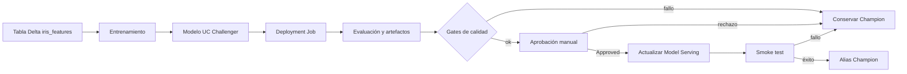

# Arquitectura

El ciclo separa entrenamiento, evaluación, aprobación y despliegue. Los
notebooks de entrenamiento registran versiones como `Challenger`; los
notebooks de `deployment/` gestionan la promoción posterior.

Responsabilidades:

- Entrenamiento: datos, modelo, evaluación inicial y registro Challenger.
- Evaluation: métricas, artefactos y gates contra Champion.
- Approval: validación del tag de aprobación de Unity Catalog.
- Deployment: actualización del endpoint, smoke test y alias Champion.
- Create job: creación y conexión del Deployment Job.

MLflow Tracking conserva runs, métricas y artefactos. Unity Catalog conserva el
modelo, sus versiones, tags, descripciones y aliases. Lakeflow Jobs orquesta
las tareas. Model Serving expone exactamente la versión aprobada.

Las utilidades se encuentran en `tools/src/iris_mlflow_utils`: `config.py`,
`data.py`, `evaluation.py`, `deployment.py`, `registry.py` y `serving.py`.
