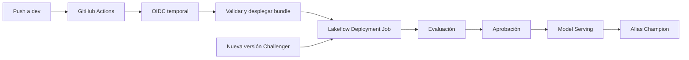
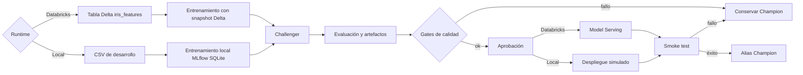

# Arquitectura

El ciclo separa entrenamiento, evaluación, aprobación y despliegue. Los
notebooks de entrenamiento registran versiones como `Challenger`; los
notebooks de `deployment/` gestionan la promoción posterior.

## Dos niveles de despliegue

El proyecto distingue dos procesos que no deben confundirse:

1. **Despliegue del proyecto:** GitHub Actions usa el bundle para construir el
   wheel, subir notebooks y configuración, y crear o actualizar los Lakeflow
   Jobs en Databricks.
2. **Despliegue de una versión del modelo:** una vez conectado el Deployment
   Job al modelo registrado, Databricks ejecuta evaluación, aprobación y Model
   Serving cuando aparece una nueva versión candidata.

GitHub prepara y actualiza la infraestructura; no entrena ni promueve modelos.
Los notebooks del ciclo del modelo se ejecutan dentro de Databricks.

En Databricks, `dev` usa `workspace.default.iris_classifier_dev` y
`iris-classifier-dev`; `prod` conserva `workspace.default.iris_classifier` e
`iris-classifier`. Esto impide que un bundle sobrescriba el `deployment_job_id`
o endpoint del otro ambiente.

La rama local comparte evaluación, gates, aliases y artefactos, pero reemplaza
Unity Catalog y Model Serving por SQLite y un manifiesto auditable. Sólo la
rama Databricks es productiva.

Responsabilidades:

- Entrenamiento: datos, modelo, evaluación inicial y registro Challenger.
- Evaluation: métricas, artefactos y gates contra Champion.
- Approval: validación del tag de aprobación de Unity Catalog.
- Deployment: actualización del endpoint, smoke test y alias Champion.
- Bundle: creación declarativa del job, wheel, permisos y targets.
- Connect job: asociación del ID administrado por el bundle con el modelo.

Cada entrenamiento registra `feature_table_version`. La evaluación reconstruye
ese snapshot y, si Champion proviene de otro snapshot, reevalúa ambos modelos
sobre el snapshot del candidato antes de aplicar el gate.

MLflow Tracking conserva runs, métricas y artefactos. Unity Catalog conserva el
modelo, sus versiones, tags, descripciones y aliases. Lakeflow Jobs orquesta
las tareas. Model Serving expone exactamente la versión aprobada.

## Lugares de ejecución

- **GitHub runner:** checkout, controles de calidad, instalación de la CLI,
  construcción del wheel y llamadas de despliegue.
- **Databricks serverless:** evaluación, aprobación, despliegue, smoke test y
  promoción de aliases.
- **Máquina local:** entrenamiento y simulación del flujo cuando
  `IRIS_RUNTIME=local`; no modifica Unity Catalog ni Model Serving.

`databricks.yml` es la única fuente de verdad de la infraestructura. El
notebook `create_deployment_job.ipynb` conserva el nombre por compatibilidad,
pero ya no crea ni resetea jobs: sólo registra `deployment_job_id` en el modelo.

Las utilidades se encuentran en `src/iris_mlflow_utils`: `config.py`,
`data.py`, `evaluation.py`, `deployment.py`, `registry.py` y `serving.py`.
